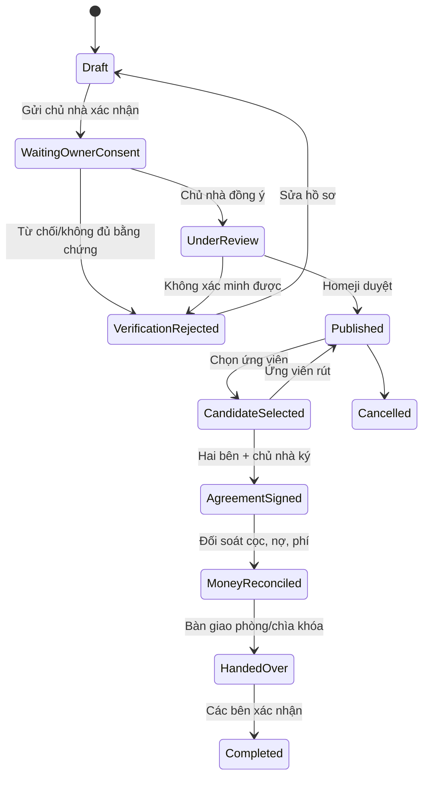

# Nghiên cứu chức năng pass phòng, ở ghép và chia sẻ ảnh an toàn cho Homeji

> Ngày rà soát: 22/07/2026  
> Phạm vi: quy trình sinh viên pass/chuyển giao phòng đang thuê; ghép roommate và chat ảnh; audit UI/UX trực tiếp SacoStay; đối chiếu frontend `C:\EXE101_Homeji` và backend `C:\Homeji`.  
> Lưu ý: đây là nghiên cứu sản phẩm/kỹ thuật, không phải tư vấn pháp lý. Trước khi vận hành giao dịch thật tại Việt Nam cần luật sư rà soát hợp đồng, tiền cọc và trách nhiệm các bên.

## 1. Kết luận dùng ngay

1. Không gom mọi trường hợp vào một nút “Pass phòng”. Cần bắt người đăng chọn:
   - **Sang/chuyển giao hợp đồng – rời hẳn**: người mới thay người cũ; chỉ hoàn tất khi chủ nhà chấp thuận và có hợp đồng/phụ lục mới.
   - **Cho thuê lại tạm thời – sẽ quay lại**: người thuê ban đầu vẫn còn trách nhiệm theo thỏa thuận gốc. Cách phân biệt này được University of Toronto dùng để giải thích `assignment` và `sublet`; cả hai luồng đều cần sự cho phép của chủ nhà ([University of Toronto Student Life](https://studentlife.utoronto.ca/task/assigning-and-subletting/)). Tại Việt Nam, Điều 475 Bộ luật Dân sự 2015 quy định bên thuê chỉ được cho thuê lại tài sản nếu bên cho thuê đồng ý ([Cơ sở dữ liệu văn bản pháp luật, Bộ Tư pháp](https://vbpl.moj.gov.vn/toaannhandantoicao/Pages/vbpq-toanvan.aspx?ItemID=95942&Keyword=91%2F2015%2FQH13)).
2. **Không xuất bản tin pass chỉ dựa trên lời khai của người thuê.** P0 phải có xác minh phòng và bằng chứng chủ nhà đồng ý; tài liệu gốc để riêng tư, UI công khai chỉ hiện kết quả xác minh.
3. Quy trình nên là: `Nháp → Chờ chủ nhà đồng ý → Homeji xác minh → Đang tìm người nhận → Đã chọn ứng viên → Đã ký → Đối soát cọc/chi phí → Bàn giao → Hoàn tất/Hủy`.
4. Homeji đã có nền tảng khá tốt cho ở ghép: `RoommateShare`, lời mời hai chiều, và chỉ tạo `RoommateConversation` sau khi người nhận chấp nhận. Vì vậy, **mở gửi ảnh sau khi accept lời mời** là đường triển khai an toàn và ít phá vỡ nghiệp vụ nhất.
5. Chat ảnh không nên là URL ảnh chèn vào `body`. Cần attachment có kiểu dữ liệu, quyền truy cập, trạng thái quét/kiểm duyệt, retention và audit riêng.
6. Từ SacoStay, nên mượn định vị “match phòng – match người – match cách sống”, quiz lối sống và mô hình hai bên cùng thích rồi mới nhắn. Không nên sao chép ảnh hero quá lớn, màn loading trắng, địa chỉ chính xác công khai, hoặc nhãn “đã xác minh” không có bằng chứng theo từng tin ([trang chủ SacoStay](https://www.sacostay.id.vn/), [luồng tìm bạn](https://www.sacostay.id.vn/discovery), [danh sách phòng](https://www.sacostay.id.vn/rooms)).

## 2. Định nghĩa nghiệp vụ “pass phòng”

### 2.1. Hai luồng phải tách biệt

| Luồng | Ý định người đăng | Trách nhiệm sau ngày bàn giao | Điều kiện hoàn tất trên Homeji |
|---|---|---|---|
| Sang/chuyển giao hợp đồng | Rời hẳn, người mới thay thế | Theo văn bản được chủ nhà chấp thuận | Chủ nhà xác nhận; hợp đồng/phụ lục mới; biên bản bàn giao |
| Cho thuê lại tạm thời | Vắng một thời gian rồi quay lại | Người thuê gốc có thể vẫn chịu trách nhiệm | Chủ nhà cho phép cho thuê lại; thỏa thuận thời hạn và trách nhiệm |

University of Toronto giải thích rằng khi `assignment` có hiệu lực, người nhận thay người thuê cũ; với `sublet`, người thuê cũ dự định quay lại và vẫn có trách nhiệm. Đây là mô hình tham khảo sản phẩm, không phải kết luận về luật Việt Nam ([nguồn](https://studentlife.utoronto.ca/task/assigning-and-subletting/)). Yêu cầu tối thiểu áp dụng tại Việt Nam là phải thu được sự đồng ý của bên cho thuê trước luồng cho thuê lại theo Điều 475 ([Bộ Tư pháp](https://vbpl.moj.gov.vn/toaannhandantoicao/Pages/vbpq-toanvan.aspx?ItemID=95942&Keyword=91%2F2015%2FQH13)).

### 2.2. State machine đề xuất

UBC dùng quy trình có điều kiện đủ tư cách, đơn đăng ký, phê duyệt và thỏa thuận viết; việc hai người tự đồng ý đổi phòng không bảo đảm được đơn vị quản lý chấp thuận ([UBC subletting](https://vancouver.housing.ubc.ca/applications/subletting/), [UBC room switch](https://vancouver.housing.ubc.ca/moving-in/switch/)). Homeji nên áp dụng nguyên tắc tương tự: thỏa thuận giữa hai sinh viên **không được tự động chuyển trạng thái thành hoàn tất**.

### 2.3. Dữ liệu bắt buộc

**Thông tin công khai của tin**

- Kiểu chuyển giao: `assignment` hoặc `temporary_sublet`.
- Khu vực gần đúng; không công khai số nhà/phòng trước khi đủ điều kiện chia sẻ.
- Giá thuê, tất cả phí định kỳ, tiền cọc, khoản phí pass nếu có, người nhận/hoàn cọc.
- Ngày vào, ngày kết thúc hợp đồng gốc, thời hạn tối thiểu, lý do pass ở mức an toàn.
- Diện tích, số người hiện tại/tối đa, số chỗ trống, nội thất và nội quy.
- Bộ ảnh phòng đã làm sạch PII: toàn cảnh, WC/bếp, lối vào, đồng hồ điện nước, hư hỏng hiện hữu.
- Badge tách riêng: `Đã xác minh sinh viên`, `Chủ nhà đã đồng ý`, `Phòng đã kiểm tra`, kèm ngày xác minh và phạm vi xác minh.

**Bằng chứng riêng tư**

- Thông tin chủ nhà/người quản lý và kênh xác nhận độc lập.
- Hợp đồng gốc, ngày hết hạn, điều khoản chuyển giao/cho thuê lại.
- Văn bản đồng ý của chủ nhà; hợp đồng/phụ lục mới.
- Biên bản tình trạng phòng, công tơ, tài sản, chìa khóa.
- Đối soát tiền thuê, điện/nước/internet, nợ, cọc và hoàn cọc.

Tài liệu chứa CCCD, chữ ký, số điện thoại, số hợp đồng hoặc địa chỉ đầy đủ không được đưa vào gallery/chat công khai. UI chỉ hiện kết quả kiểm tra và cho phép nhân sự có quyền truy cập bằng audit log.

### 2.4. Safeguards chống lừa đảo

UBC cảnh báo các dấu hiệu như yêu cầu trả tiền trước khi xem phòng, chỉ nhận tiền mặt, đặt cọc tiền mặt hoặc chuyển khoản/wire bất thường; đơn vị này còn hỗ trợ kiểm tra phòng/địa chỉ có tồn tại hay không ([UBC Housing](https://vancouver.housing.ubc.ca/applications/subletting/)). Homeji nên có:

- Cảnh báo “Không đặt cọc trước khi xem/xác minh phòng” ngay sát CTA ứng tuyển và trong chat khi phát hiện yêu cầu chuyển tiền.
- Xác minh email/sinh viên, số điện thoại, phòng, hợp đồng và sự đồng ý của chủ nhà theo từng badge.
- Nút report tin, report tin nhắn/ảnh và block người dùng; lưu bằng chứng phục vụ tranh chấp.
- So trùng ảnh, địa chỉ, số điện thoại và tin có giá bất thường; rate limit tạo tin/liên hệ.
- Không cho người đăng tự gắn badge; chỉ workflow kiểm duyệt mới cấp/thu hồi badge.
- Tự hết hạn tin theo hợp đồng; audit mọi lần sửa giá, cọc, ngày ở, consent và trạng thái.

## 3. Ở ghép: matching và chat ảnh

### 3.1. Ghép hai chiều, không phải một người tự thêm người kia

UCLA yêu cầu roommate request phải tương hỗ; nếu chưa có roommate được chấp nhận, hệ thống dùng lifestyle preferences để ghép ([UCLA Housing](https://ask.housing.ucla.edu/app/answers/detail/a_id/66/~/roommate-selection)). UC Berkeley cũng khuyến nghị hai bên xác nhận lẫn nhau và trao đổi trước về thói quen học, vệ sinh và khách đến chơi ([UC Berkeley Housing](https://housing.berkeley.edu/apply/how-to-apply-for-undergraduate-housing/how-to-apply-with-a-roommate/)).

Luồng Homeji đề xuất:

1. Người có phòng hoặc quan tâm cùng một phòng gửi **Yêu cầu ở ghép**.
2. Trước khi accept, bên nhận xem compatibility card và gallery phòng đã kiểm duyệt; không thấy địa chỉ chính xác.
3. Bên nhận `Accept/Decline/Report/Block`.
4. Chỉ sau accept mới tạo conversation giàu nội dung và mở attachment ảnh.
5. Trước khi xác nhận dọn vào, hai bên hoàn thành “Thỏa thuận roommate” dạng checklist.

Compatibility card nên tập trung vào hành vi sống: ngân sách và cách chia phí, ngày vào ở, giờ ngủ/học, mức ồn, vệ sinh, nấu ăn, hút thuốc, vật nuôi, khách qua đêm, chia sẻ đồ dùng, phương tiện và thời hạn dự kiến. Không xếp hạng theo thuộc tính nhạy cảm không cần thiết.

### 3.2. Vì sao chỉ mở ảnh sau khi kết nối được chấp nhận

Airbnb chỉ cho phép gửi ảnh/video trong message sau khi reservation đã được xác nhận và cho phép report nội dung vi phạm ngay từ message ([Airbnb Help](https://www.airbnb.com/help/article/3759)). Bumble có report ở cấp tin nhắn và block; báo cáo được giữ ẩn danh với người bị báo cáo ([Bumble Support](https://support.bumble.com/hc/en-us/articles/28784521408029-Reporting-inappropriate-messages)). Tinder cho phép người dùng giới hạn message ở người đã photo-verified ([Tinder Help](https://www.help.tinder.com/hc/en-us/articles/4408385774989-Photo-Verified-Chat)).

Áp dụng cho Homeji:

- Trước accept: chỉ text giới hạn + gallery phòng đã kiểm duyệt; tốt hơn nữa là không mở chat tự do, chỉ cho câu hỏi nhanh.
- Sau accept: mở ảnh với chip ngữ cảnh `Ảnh phòng hiện tại`, `WC`, `Bếp`, `Lối vào`, `Đồng hồ điện nước`, `Hư hỏng`.
- Có preview + xác nhận trước gửi, progress/retry, xóa ảnh do mình gửi, report ảnh/tin nhắn, block người dùng.
- Làm mờ nội dung nghi nhạy cảm trước khi người nhận chọn xem; không coi ảnh chụp màn hình giấy tờ là bằng chứng xác minh.
- Cho phép tùy chọn “Chỉ tài khoản sinh viên đã xác minh mới được nhắn/gửi ảnh”.

### 3.3. Upload ảnh an toàn

OWASP khuyến nghị allowlist extension, kiểm tra MIME và chữ ký file ở server, đổi tên file, giới hạn kích thước, xác thực/phân quyền, lưu ngoài webroot hoặc ở host riêng, quét file khi có thể, CSRF protection và cơ chế báo cáo lạm dụng ([OWASP File Upload Cheat Sheet](https://cheatsheetseries.owasp.org/cheatsheets/File_Upload_Cheat_Sheet.html)).

Cloudinary hỗ trợ `allowed_formats`, kiểu delivery `private`/`authenticated` và moderation ngay trong Upload API; tài liệu access control của hãng cũng mô tả signed URL và URL tải xuống có thời hạn cho asset riêng tư. Đây là khả năng hạ tầng có thể tận dụng, nhưng Homeji vẫn phải kiểm tra quyền conversation trước khi phát URL ([Cloudinary Upload API](https://cloudinary.com/documentation/image_upload_api_reference), [Cloudinary Media Access Control](https://cloudinary.com/documentation/control_access_to_media)).

MVP Homeji nên giới hạn:

- Chỉ JPEG/PNG/WebP; chưa nhận SVG, GIF, video hay tài liệu.
- Tối đa 5 ảnh/lần gửi và 8 MB/ảnh (giới hạn sản phẩm cần đo lại sau beta).
- Server decode rồi re-encode ảnh, đồng thời xóa EXIF/GPS; tạo thumbnail.
- Object key ngẫu nhiên; private bucket; URL ký ngắn hạn và mỗi lần đọc phải kiểm tra user còn thuộc conversation.
- Bảng attachment lưu `status = PendingScan | Ready | Rejected | Deleted`, hash, MIME đã xác thực, width/height, uploader, timestamps.
- Quota theo user/conversation/ngày; malware scan và moderation queue; retention/xóa rõ ràng.

## 4. Audit UI/UX trực tiếp SacoStay

Audit được thực hiện ở desktop, chưa đăng nhập, ngày 22/07/2026. Các nhận xét dưới đây là quan sát trực tiếp, không suy đoán về backend.

### 4.1. Điểm nên học

| Bề mặt | Quan sát | Áp dụng cho Homeji |
|---|---|---|
| Landing | Hero truyền đạt nhanh “Match phòng – Match người – Match cách sống”; palette cam/kem thân thiện; top nav tách `Tìm bạn`, `Phòng trọ`, `Bản đồ`, `Tin nhắn` ([trang chủ](https://www.sacostay.id.vn/)) | Dùng một value proposition ngắn cho module ở ghép/pass phòng; giữ map là năng lực khác biệt của Homeji |
| Tìm bạn | Giải thích 5 bước: quiz → % hòa hợp → lướt thẻ → match hai chiều → mở tin nhắn ([discovery](https://www.sacostay.id.vn/discovery)) | Cho người dùng hiểu vì sao cần khai báo lối sống; preview tiêu chí trước khi bắt đầu |
| Danh sách phòng | Card scan nhanh nhờ ảnh, giá/tháng, tên và địa chỉ; CTA `Xem bản đồ` và `Bộ lọc` rõ ([rooms](https://www.sacostay.id.vn/rooms)) | Card pass phòng thêm deadline, ngày vào, số chỗ, loại chuyển giao và badge consent |
| Chi tiết | `Báo cáo`, `Chia sẻ`, `Yêu thích`, `Liên hệ xem phòng`, `Nhắn tin` đều dễ tìm ([mẫu chi tiết](https://www.sacostay.id.vn/rooms/14b4a0b9-91fd-4e08-8439-4bc395168618?from=rooms)) | Giữ report ngay đầu trang; CTA pass phải hiển thị điều kiện chủ nhà và cảnh báo cọc |

### 4.2. Điểm không nên sao chép

| Vấn đề quan sát | Tác động | Cách Homeji làm tốt hơn |
|---|---|---|
| Hero landing và ảnh phòng chiếm gần toàn bộ first fold | CTA/giá/thông tin quyết định bị đẩy xuống dưới | Desktop dùng gallery 55–65% chiều ngang + summary/CTA sticky cùng fold; mobile giữ CTA sticky đáy |
| `/rooms` ban đầu hiện vùng trắng khoảng 1–2 giây trước khi card xuất hiện | Người dùng tưởng trang hỏng | Dùng `HomeListingSkeleton`/skeleton theo card, empty và error state tách biệt |
| Landing nói tin/chủ trọ đã xác minh nhưng card/detail mẫu không cho thấy badge hoặc phạm vi xác minh | “Verified” khó kiểm chứng | Badge theo từng claim, có tooltip “đã kiểm tra gì, khi nào”, không dùng một dấu tick chung |
| Detail hiển thị địa chỉ khá chi tiết trước đăng nhập | Rủi ro an toàn/PII cho người đang ở | Công khai khu vực gần đúng; chỉ chia sẻ điểm hẹn/địa chỉ chính xác sau consent phù hợp |
| `0/2` gắn nhãn “Số người” | Không rõ là đang ở/tối đa hay chỗ còn trống | Viết rõ `Đang ở 0 · Tối đa 2 · Còn 2 chỗ` |
| Tiện nghi “Điều hòa” xuất hiện lặp trong mẫu audit | Giảm độ tin cậy dữ liệu | Dedupe theo amenity code ở API và UI |
| Banner tải app nổi ở góc trái trên mọi trang | Che nội dung và cạnh tranh với CTA chính | Chỉ hiện sau tín hiệu intent hoặc một lần/session; tôn trọng dismiss |
| Nút `Bắt đầu trắc nghiệm` trong phiên audit không tạo chuyển tiếp nhìn thấy | Dead-end ở bước onboarding | Có loading/progress/error rõ và test E2E guest → quiz → đăng ký → quay lại kết quả |

## 5. Khoảng cách với Homeji hiện tại

### 5.1. Những gì đã có thể tái sử dụng

- FE đã có `RentalPostType.RoommateShare` trong `src/api/types.ts`.
- FE có API lời mời `createInvitation/acceptInvitation/rejectInvitation/cancelInvitation` và hội thoại gắn tin phòng trong `src/api/index.ts`.
- `MapMessagesPanel.tsx` đã có composer, inbox/unread, tìm trong hội thoại và menu đính kèm vị trí/địa chỉ/địa điểm/tin đăng. Cấu trúc menu `+` phù hợp để thêm entry ảnh sau khi attachment API sẵn sàng.
- BE `RoommateInvitationService` đã buộc hai người cùng lưu một phòng; khi người nhận accept mới tạo `RoommateConversation`. Đây chính là gate phù hợp để mở ảnh.
- BE đã kiểm tra membership conversation trước đọc/gửi message trong `PostConversationService` và `RoommateChatService`.
- Gallery tin phòng đã có `RentalPostMedia` và upload ảnh, nhưng không nên dùng chung entity này cho ảnh chat vì lifecycle, quyền đọc, moderation và retention khác nhau.

### 5.2. Gap cần xử lý

- `PostMessage`/`PostMessageDto` và `RoommateMessage` hiện chỉ có `Body`; FE `PostMessage` cũng chỉ có `body`. Chia sẻ vị trí đang được serialize vào text body (`chatLocation.ts`), nhưng ảnh không nên tiếp tục theo pattern này.
- Homeji đang có cả post conversation và roommate conversation. Attachment nên có một contract/domain policy dùng chung, tránh xây hai pipeline upload/moderation khác nhau.
- Chưa có aggregate/state machine cho pass phòng, consent chủ nhà, ứng viên nhận pass, đối soát cọc và bàn giao.
- `RentalPost` hiện đại diện tin do owner đăng. Không nên giả vờ người thuê là owner để tái sử dụng API; việc đó phá authorization và audit.
- Report hiện có target cho một số entity nhưng cần target cấp `Message` và `Attachment`, cộng block user và moderation queue.
- Upload hiện tại chưa đủ an toàn để tái sử dụng nguyên trạng cho chat: `UploadController` nhận tối đa 10 file/request và đặt request limit 50 MB; `CloudinaryOptions` giới hạn mặc định 10 MB/file. `CloudinaryImageUploadService` cho JPEG/PNG/GIF/WebP/**SVG/BMP** và quyết định allow/deny từ chuỗi `Content-Type` do request cung cấp, chưa thấy magic-byte/signature validation hay bước decode/re-encode. Chat cần policy riêng nhỏ hơn, không SVG/GIF/BMP ở MVP, kiểm tra nội dung thực và quyền conversation trước khi cấp upload/read access.

## 6. Kiến trúc đề xuất

### 6.1. Aggregate và projection

Tạo aggregate riêng `RoomTransferCase`, vì người khởi tạo là **current tenant**, còn chủ nhà là approver:

- `RoomTransferCase`: mode, outgoingTenantId, rentalPostId hoặc room snapshot, dates, rent/deposit/fees, consent status, verification status, lifecycle status.
- `RoomTransferEvidence`: loại tài liệu, private object key, reviewer, decision, expiry; không trả raw path ra public DTO.
- `RoomTransferCandidate`: applicant, intro, status, timestamps; unique pending/selected constraint hợp lý.
- `RoomTransferHandover`: checklist, meter readings, asset/damage summary, acknowledgements.
- Public `RentalPost`/search projection có thể mang `source = OwnerListing | TenantTransfer` và `transferCaseId`, nhưng authorization vẫn dựa trên aggregate nguồn.
- Index gợi ý: `(status, published_at desc)`, `(outgoing_tenant_id, status)`, `(owner_consent_status, verification_status)`, unique một case active cho cùng room/lease khi đủ dữ liệu định danh.

### 6.2. Attachment chat

- `MessageAttachment`: `id`, `messageId`, `uploaderId`, `kind`, `objectKey`, `thumbnailKey`, `mime`, `bytes`, `width`, `height`, `sha256`, `status`, moderation fields, timestamps.
- Upload hai bước: `POST /api/conversations/{id}/attachments/init` → upload private object → `POST .../complete`; server kiểm tra membership ở cả hai bước.
- Gửi message tham chiếu attachment đã `Ready`; transaction bảo đảm message và ownership liên kết nhất quán.
- API trả URL ký ngắn hạn hoặc endpoint stream có authorization; không lưu public URL lâu dài.
- Domain policy `CanShareRichMedia` dùng được cho post/roommate conversation, nhưng với roommate phải kiểm tra invitation đã `Accepted`.
- Không gọi thẳng endpoint Cloudinary unsigned hiện tại từ chat client. Backend phải kiểm tra magic bytes, decode/re-encode, tạo object key và ràng buộc attachment với conversation; nếu vẫn dùng Cloudinary thì delivery mode/preset phải bảo đảm asset không trở thành URL public vĩnh viễn.

### 6.3. Trade-off chính

| Cách | Ưu | Nhược | Khuyến nghị |
|---|---|---|---|
| Nhét URL ảnh vào `Body` | Nhanh | Không có quyền đọc, scan, delete, audit; preview/search lỗi | Không dùng |
| Tái dùng `RentalPostMedia` | Ít bảng | Quyền/lifecycle của gallery và chat khác nhau | Không dùng |
| `MessageAttachment` riêng, policy dùng chung | Đúng domain, kiểm soát an toàn, mở rộng được | Cần migration/API/upload workflow | Chọn |
| Gộp pass phòng vào `RoommateShare` | UI ít thay đổi | Lẫn landlord listing với tenant transfer; consent và cọc không có chỗ | Chỉ dùng search projection chung, không gộp aggregate |

## 7. Backlog triển khai

### P0 — tạo niềm tin trước khi tăng tương tác

- Aggregate/migration/API cho `RoomTransferCase`, consent và verification.
- Wizard đăng pass: chọn loại → hợp đồng/chi phí → phòng/ảnh → chủ nhà xác nhận → review.
- Public card/detail với badge theo claim, ngày vào, deadline, cọc, phí và cảnh báo chống lừa đảo.
- Ứng tuyển/chọn ứng viên; audit log; tự hết hạn; report tin.
- Giữ mutual roommate invitation; thêm compatibility card và gallery phòng đã kiểm duyệt trước accept.

### P1 — chat ảnh an toàn và hoàn tất giao dịch

- `MessageAttachment`, private upload, validate/re-encode/strip EXIF, signed access.
- Image preview/progress/retry; report/block; chỉ mở sau accept lời mời ở ghép.
- Owner approval link có token một lần + phương án nhân sự xác minh thủ công.
- Checklist ký/đối soát/bàn giao; receipts/acknowledgements, không xử lý escrow nếu chưa có năng lực pháp lý/vận hành.
- Lifestyle compatibility và roommate agreement.

### P2 — tự động hóa có kiểm soát

- Moderation ảnh tự động + human review; phát hiện trùng ảnh/địa chỉ/giá bất thường.
- Ranking tin pass theo ngày cần vào, trường/khu vực, ngân sách và compatibility.
- Dashboard funnel/risk; nhắc consent, hết hạn và bàn giao.
- Chỉ cân nhắc giữ/điều phối tiền cọc sau khi có thiết kế pháp lý, kế toán, dispute và payment compliance đầy đủ.

## 8. Acceptance criteria và test quan trọng

**Pass phòng**

- Không publish khi thiếu consent chủ nhà hoặc verification bị reject/expire.
- Người thuê không thể tự approve consent; mọi thay đổi tiền/ngày sau duyệt phải quay lại review.
- Không thể hoàn tất trước khi agreement, money reconciliation và handover acknowledgement đủ.
- Tin tự ẩn khi hết hạn hợp đồng/available window; case hủy không còn trong search.
- Public DTO không lộ evidence path, CCCD, chữ ký, số phòng hoặc địa chỉ chính xác.

**Roommate/chat ảnh**

- Chưa accept invitation thì upload/send attachment trả `403`.
- User ngoài conversation không init upload, complete upload hoặc đọc signed URL được.
- File giả MIME, SVG/script, vượt size, quá quota hoặc scan fail bị từ chối.
- EXIF/GPS bị loại; delete/report/block có audit; attachment bị xóa/khóa không còn truy cập qua URL cũ.
- Retry upload không tạo message/attachment trùng; transaction không để orphan object lâu dài.
- E2E mobile/desktop: request → accept → gửi ảnh → report/block; đầy đủ loading, empty, error và keyboard/accessibility state.

## 9. Chỉ số nên theo dõi

- Tỷ lệ case từ draft → có consent → publish → chọn ứng viên → bàn giao hoàn tất.
- Thời gian trung vị chờ chủ nhà xác nhận và Homeji review.
- Tỷ lệ tin bị report/reject, lý do reject, số vụ yêu cầu đặt cọc trước xem phòng.
- Tỷ lệ roommate request được accept; tỷ lệ mở chat và hoàn thành roommate agreement.
- Attachment upload success/retry/reject, report trên 1.000 ảnh, thời gian xử lý moderation.
- Không tối ưu chỉ theo số message; north-star nên là **kết nối được xác minh dẫn tới xem phòng/bàn giao an toàn**.

## 10. Nguồn primary/first-party

- [Bộ Tư pháp Việt Nam — Bộ luật Dân sự 2015, Điều 475](https://vbpl.moj.gov.vn/toaannhandantoicao/Pages/vbpq-toanvan.aspx?ItemID=95942&Keyword=91%2F2015%2FQH13)
- [University of Toronto Student Life — Assigning and subletting](https://studentlife.utoronto.ca/task/assigning-and-subletting/)
- [UBC Student Housing — Subletting](https://vancouver.housing.ubc.ca/applications/subletting/)
- [UBC Student Housing — Room switch](https://vancouver.housing.ubc.ca/moving-in/switch/)
- [UCLA Housing — Roommate selection](https://ask.housing.ucla.edu/app/answers/detail/a_id/66/~/roommate-selection)
- [UC Berkeley Housing — Apply with a roommate](https://housing.berkeley.edu/apply/how-to-apply-for-undergraduate-housing/how-to-apply-with-a-roommate/)
- [Airbnb Help — Sending photos and videos in messages](https://www.airbnb.com/help/article/3759)
- [Bumble Support — Reporting inappropriate messages](https://support.bumble.com/hc/en-us/articles/28784521408029-Reporting-inappropriate-messages)
- [Tinder Help — Photo Verified Chat](https://www.help.tinder.com/hc/en-us/articles/4408385774989-Photo-Verified-Chat)
- [OWASP — File Upload Cheat Sheet](https://cheatsheetseries.owasp.org/cheatsheets/File_Upload_Cheat_Sheet.html)
- [Cloudinary — Upload API Reference](https://cloudinary.com/documentation/image_upload_api_reference)
- [Cloudinary — Media Access Control and Authentication](https://cloudinary.com/documentation/control_access_to_media)
- [SacoStay — landing](https://www.sacostay.id.vn/), [discovery](https://www.sacostay.id.vn/discovery), [rooms](https://www.sacostay.id.vn/rooms), [detail mẫu](https://www.sacostay.id.vn/rooms/14b4a0b9-91fd-4e08-8439-4bc395168618?from=rooms)
